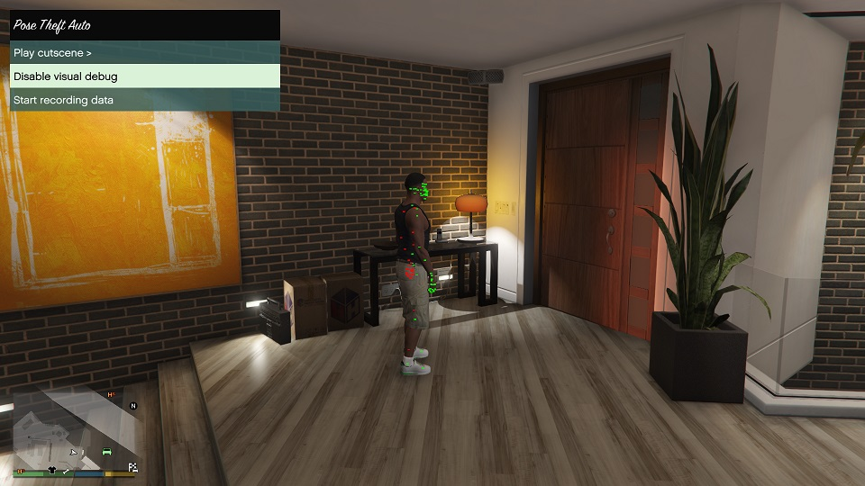

# Pose Theft Auto

A GTA5 mod that extracts pose data from pedestrians and saves it alongside with gameplay screenshots.

The goal of this project is to provide sample data to train ML models to detect human poses.

### Usage
1. Install ScriptHookV.
2. Copy `./bin/Release/PoseTheftAuto.asi` into your GTA5 main folder.
3. Launch the game and while in gameplay press F5 to bring up the menu.

### Data recording
If data is recorded while in a cutscene a `cutscene_name` folder will be created, `gameplay` otherwise.

After a recording data from gameplay the following folder structure will be created in your GTA5 main folder:

`./pta/<cutscene|gameplay>/peds.csv`:
| frame | character | bone | x | y | z | x_2d | y_2d | occluded |
| ----- | --------- | ---- | - | - | - | ---- | ---- | -------- |
| 1 | -1692214353 | 0 | -40.734108 | -1096.503174 | 26.380863 | -1.000000 | -1.000000 | 1 |
| ... | ... | ... | ... | ... | ... | ... | ... | ... |
| 500 | -1692214353 | 58271 | -40.713646 | -1096.591553 | 26.300863 | 0.001896 | 0.661698 | 1 |

`./pta/<cutscene|gameplay>/camera.csv`:
| frame | x | y | z | rot_x | rot_y | rot_z |
| ----- | - | - | - | ----- | ----- | ----- |
| 1 | -42.247494 | -1093.140747 | 26.515631 | 2.77165 | 0.0 | -190.425171 |
| ... | ... | ... | ... | ... | ... | ... |
| 5 | -42.247494 | -1093.140747 | 26.515631 | 2.77165 | 0.0 | -190.425171 |

`./pta/<cutscene|gameplay>/frames/`:

Frame images, name is the frame index.

### Notes:
- Occlusion detection is not perfect, specially in cutscenes.
- The `character` and `bone` fields are internal ids used by the game, they can be discarded or used to detect how many characters are in the scene etc.
- The `x_2d` and `y_2d` fields correspond to the 2D position of the bone on the screen. If the images are 1920x1080 and `x_2d=1, y_2d=1` this means that the bone is at the bottom right corner.
- The mod may be unstable since it forces physics onto every object in order for the occlusion to work in some cases.